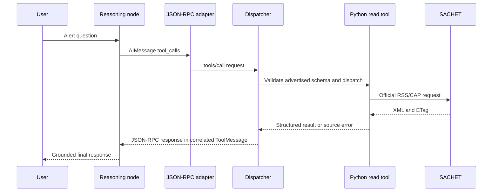

# JalWatch India: architecture and state contract

## Current status

Task 0 provides packaging and development checks. **Task 1 — State Management**
adds a typed shared-memory schema, validated domain records, and an initial-state
helper. **Task 2 — Reasoning Node** adds one async model decision, schema-only
SACHET alert contracts, and JSON-RPC request translation. **Task 3** adds a
small SACHET client, local tool registry, typed dispatcher, ToolMessages, and a
reasoning/tool loop. **Task 4 — MCP** adds a separate stdio server, runtime
discovery, and an MCP-backed graph. **Task 5** adds deterministic pre/post tool
hooks. **Task 6** adds a conditional HITL graph with in-process checkpointing,
human approval and a server-verified exact-action grant. **Task 7** adds safe
context compaction and `AsyncSqliteSaver` restart recovery. **Task 8** adds
optional Langfuse v4/OpenTelemetry observations. **Task 9** adds the evaluation,
FastAPI, MCP HTTP, Docker, and Render preparation boundary.

## Overall design

The original scope included NWDP station, river-level, and reservoir monitoring.
The [official-data feasibility spike](data-sources.md) verified live NDMA SACHET
RSS, CWC-related feed items, linked CAP 1.2 XML, and ETag/304 behavior. NWDP
station metadata timed out, leaving station IDs and telemetry schema unverified.
The **JalWatch India — CWC Flood Alert Triage & Operational Escalation Agent**
MVP therefore focuses on SACHET alerts. One stateful LangGraph agent will
review official CWC-related flood/river alerts through a local source adapter,
distinguish active from recent/expired alerts, and recommend local operational
escalation when appropriate.
Creating an escalation requires explicit human approval on the Task 6 HITL path.

Current hosted flow: alert question → stateful reasoning → authenticated MCP
client over Streamable HTTP → mounted MCP server → SACHET RSS/CAP adapter →
ToolMessage → reasoning again. The stdio flow remains for local demos.
Consequential writes pause for approval before execution on that path.

Package responsibilities:

- `agent`: state and graph orchestration, including reasoning prompts.
- `domain`: business data and domain rules, separate from prompts.
- `tools`: monitoring capabilities and eventual escalation operation.
- `mcp`: dynamic discovery and client/server transport.
- `hooks`: deterministic pre-tool and post-tool checks.
- `hitl`: approval graph, signed grant, and terminal demonstration.
- `persistence`: compaction, local Ollama summary model, and SQLite lifecycle.
- `telemetry`: optional Langfuse v4 adapter, redaction, and safe event boundary.

The tool surface is `list_active_cwc_alerts(region?, severity?)`,
`get_alert_details(alert_ref)`, `search_recent_cwc_alerts(hours, region?)`,
`list_affected_regions()`, and
`create_escalation(alert_refs, region, rationale, severity)`. Four read tools
execute against SACHET. The local escalation handler exists but model dispatch
returns `APPROVAL_REQUIRED` on ordinary MCP calls. Only a valid trusted approval
grant can invoke the handler.
The three provisional NWDP station contracts were removed after the spike.

This is decision support: it must not claim independent flood prediction,
control reservoirs, or autonomously issue public emergency warnings.

## Assignment progress

- Task 1 — State Management: COMPLETE
- Task 2 — Reasoning Node: COMPLETE (Groq; SACHET schema-only tool requests)
- Task 3 — Tool Provisioning and Execution: COMPLETE (local JSON-RPC)
- Task 4 — MCP: COMPLETE (official Python SDK v2, stdio)
- Task 5 — Lifecycle Hooks: COMPLETE (grounding and result validation)
- Task 6 — Human-in-the-Loop: COMPLETE (interrupt/resume; InMemorySaver)
- Task 7 — Context Compaction and Checkpointing: COMPLETE (Ollama; SQLite)
- Task 8 — Observability: COMPLETE (optional Langfuse v4)
- Task 9 — Evaluation and Deployment: IMPLEMENTATION COMPLETE; ten-trace live
  judge and local API/MCP verified; Docker/Render verification pending.

Each task begins only on explicit instruction. Dependencies are added when
needed. No multi-agent system, frontend, vector database, or cloud infrastructure
is part of the project.

## Tasks 7 and 8 runtime

```text
User -> reasoning -> pre-hook -> MCP -> post-hook -> ToolMessage
                  -> compaction check (>10 at a safe boundary)
                       -> local Ollama summary + RemoveMessage
                  -> reasoning/final
       create_escalation -> Task 6 checkpoint -> interrupt -> human decision
                         -> approved MCP write or rejection -> reasoning

AsyncSqliteSaver checkpoints graph state by thread_id throughout.
Langfuse observes the runtime around the graph; it does not control it.
```

**State versus checkpoint.** `JalWatchState` holds current working memory;
the checkpointer stores successive snapshots of that state and the graph's
continuation position. Task 6 `InMemorySaver` supports pause/resume only while
one process lives. Task 7 `AsyncSqliteSaver` keeps the checkpoint in a local
SQLite file, allowing a new process to load the same `thread_id`. A different
thread remains isolated. SQLite is appropriate for this single-PC assignment;
it is not a high-scale, multi-writer production checkpointer.

**Compaction.** A deterministic edge checks `len(messages) > 10` after a
completed tool cycle or final model answer. It never runs during an unresolved
AI tool-call exchange, approval preparation, or pending human review. Normally
the first eight messages are summarized. If the eighth message splits an AI
tool call from its result, the prefix extends only to the corresponding
`ToolMessage`(s). The local Ollama `/api/chat` backend receives the previous
summary plus selected messages and returns one new factual paragraph. It has no
tools or MCP access. `RemoveMessage` entries delete the selected IDs through
`add_messages`; recent messages remain. Missing IDs or local model failure
leave history intact. The summary is inserted into reasoning as separately
delimited context, not as a fabricated user message. Structured successful
tool messages still ground alert refs, and structured approval state plus the
signed grant still authorize writes; summary text can do neither.
An alert reference whose successful ToolMessage was compacted must be
rediscovered before it can ground a later escalation.

The default SQLite file is `data/jalwatch-checkpoints.sqlite`, configurable by
`JALWATCH_CHECKPOINT_DB`. An async context manager opens one saver for the run,
creates the parent directory, and closes the connection. Its JSON/Msgpack
serializer explicitly allowlists JalWatch Pydantic models and enums; no pickle
is used. The offline two-process demo pauses with proposal, pending approval,
summary, and messages in SQLite, exits, then reconstructs a new graph and MCP
stdio server to resume. Process B generates a **new ephemeral approval secret**;
the secret is not checkpoint state. Its new grant is signed for the exact
persisted action. Task 6's process-local escalation idempotency remains; a
crash after a write but before checkpoint commit would need a durable
idempotency store in a production deployment.

**Telemetry versus logs.** Langfuse v4 observations are OpenTelemetry spans
for connected run steps; ordinary logs describe local events without a trace
tree. The optional recorder wraps `jalwatch_run`, reasoning, MCP `tools/list`
and logical `tools/call`, hook outcomes, context summarization, approval
request/decision, and checkpoint resume. A stable hash of `thread_id` is the
Langfuse session ID across process restarts; each process invocation gets its
own root observation. The LangChain callback instruments Groq model calls as
generations. Exact provider token counts are recorded when reported; absent
counts remain unknown. The Ollama backend's `prompt_eval_count` and
`eval_count` are treated the same way. Observation lifetimes measure latency;
no sleep is used for export. The client flushes at short-lived CLI shutdown.
Redaction removes API keys, approval signatures/grants, authorization headers,
full environment dictionaries, and raw XML. Exporter failures are caught at
the telemetry boundary and must not block agent control flow.

## Task 5 lifecycle hooks

```text
AI tool call → discovered-tool check → PRE-HOOK
  reject → simulated 400 error ToolMessage → reasoning
  allow  → MCP tools/call
             MCP error → error ToolMessage → reasoning
             success   → POST-HOOK
                           reject → simulated 502 error ToolMessage → reasoning
                           accept → success ToolMessage → reasoning
```

Pydantic/MCP schemas check required fields, types, integer bounds, and nonempty
references. The pre-hook checks contextual evidence before a network call:
detail references must have appeared in successful alert results; every
escalation reference must have appeared, and at least one normalized region
associated with that evidence must match the proposed region. If region
evidence is unavailable, escalation is rejected rather than inventing a match.
The hook parses successful named `ToolMessage` JSON, not arbitrary model text.
Each AI call gets its own inspectable decision and correlated result in order.

The post-hook inspects MCP `structured_content` only when `is_error=False`.
It validates successful read results without repairing them: identity, source
severity/provenance, timezone-aware times, activity, recent-window membership,
and sorted unique regions. Empty lists are valid. Invalid data is replaced
with a simulated 502-style error, so reasoning does not receive it as evidence.
MCP errors remain errors and skip post-validation. These statuses are JSON
application payloads, not HTTP responses. Missing CAP `expires` means inactive
under JalWatch's conservative policy, not a CAP schema requirement. Task 5
does not grant approval; Task 6 adds the separate human authorization boundary.

The policy lives in `hooks/policy.py` and is independent of MCP transport.
The MCP execution node orchestrates the hook order; the client and source
adapter contain no lifecycle policy.

## Task 6 human approval boundary

```text
reasoning -> standalone create_escalation -> Task 5 pre-hook
          -> prepare proposal and pending approval -> CHECKPOINT
          -> interrupt() -> human review
              reject  -> HUMAN_REJECTED ToolMessage -> reasoning
              approve -> recheck pre-hook -> signed application-only MCP metadata
                      -> MCP create_escalation -> post-hook -> ToolMessage
                      -> reasoning
```

The graph's conditional edge inspects `AIMessage.tool_calls`. No calls end the
turn; read calls use the normal MCP execution node; exactly one standalone
`create_escalation` call enters approval preparation. A mixed batch or multiple
protected calls yield one correlated `PROTECTED_ACTION_MUST_BE_SEPARATE` error
per call and return to reasoning. This avoids ambiguous batch approval.

Preparation validates evidence and the input contract, constructs the canonical
`EscalationProposal`, and stores a `PendingEscalationApproval` with approval ID,
original tool-call ID, and a digest of the exact action. It does not call MCP.
The approval node contains no side effects before `interrupt()` because
LangGraph re-enters it on resume. Its payload includes the exact reviewed
arguments, evidence regions, and an internal-only/no-public-warning notice.
`ApprovalDecision` accepts only `approve` or `reject`, plus an optional comment;
the human cannot edit the proposed arguments. Approval uses graph control input
`Command(resume=...)`, never a new user message.

`InMemorySaver` checkpoints the pause so the same running process can resume
with the same `configurable.thread_id`. A different thread cannot resume that
pending decision. This is **not restart persistence**; the Task 7 runtime adds a
disk-backed saver and compaction. The MCP client, checkpointer connection,
thread configuration, and approval secret remain outside `JalWatchState`.

The host generates an ephemeral secret at MCP session startup and gives it to
the controlled stdio server process. After human approval, it signs canonical
JSON containing approval ID, thread ID, original tool-call ID, tool name, exact
proposal arguments, and a short expiry. The grant travels only in namespaced
MCP request metadata, never in the model-visible tool schema or ToolMessage.
The server verifies the HMAC with constant-time comparison. Missing metadata
returns `APPROVAL_REQUIRED`; a forged, expired, or argument-tampered grant
returns `INVALID_APPROVAL_GRANT`. Valid metadata authorizes exactly the reviewed
action. Ordinary model calls cannot supply metadata through `call_tool`.

After approval, the graph rechecks Task 5 grounding against persisted evidence,
calls the protected MCP path, and validates returned escalation ID, status,
timestamp, alert references, region, rationale, local severity, and approval ID.
The `approval_id` is a process-local idempotency key: an identical replay returns
the existing record, while changed arguments under the same ID fail. Rejection
does not call the write handler; the proposal remains marked rejected and a
correlated 403-style `HUMAN_REJECTED` ToolMessage explains non-execution. An
identical rejected proposal cannot immediately start another approval loop.

The terminal commands are `uv run python -m jalwatch.hitl.demo` for the offline
deterministic demonstration and `uv run --env-file .env python -m
jalwatch.hitl.demo --live --region Bihar` for optional Groq/SACHET use.


## Task 4 MCP boundary

Task 3 remains a runnable teaching path: reasoning → local registry → custom
JSON-RPC dispatcher → Python service. Task 4's normal path starts one official
MCP SDK v2 client and stdio server subprocess per application run. At startup,
`tools/list` supplies the names, descriptions, and generated input schemas.
The client converts each discovered schema to LangChain's function dictionary
and passes it into the reasoning factory. The reasoning code has no Task 4
hardcoded tool list. All pages are read before graph construction.

```text
startup: host → MCP client → stdio server → tools/list → model tool binding
runtime: user → reasoning → AIMessage.tool_calls → MCP tools/call → server
         → Python SACHET service → MCP result → correlated ToolMessage
         → reasoning → final answer
```

The four read tools delegate to existing Task 3 services. `create_escalation`
is discoverable but the server returns `APPROVAL_REQUIRED` without calling the
write handler. Annotations describe read/write intent; they are not security.
The MCP client and subprocess are runtime resources, not serializable
`JalWatchState` fields. The SDK transports MCP's JSON-RPC requests itself;
wrapping `tools/call` inside the Task 3 custom JSON-RPC envelope would be
redundant. MCP protocol IDs and LangChain `tool_call_id` are separate; the
ToolMessage uses the originating AI call ID. stdio gives a real process
boundary locally without an HTTP service lifecycle.

## Task 2 reasoning boundary

The async factory `create_reasoning_node(model)` binds the five Task 2
schema-only contracts for the retained Task 3 path. Task 4 passes the MCP
discovered schemas explicitly to the same factory with `tool_choice="auto"`.
A real model comes from
`create_groq_model()`, which requires `GROQ_API_KEY` and `JALWATCH_LLM_MODEL` in
the environment only at construction. A deterministic test model implements the
same small binding interface. Imports and offline tests need no credentials.

```text
JalWatchState
  -> SystemMessage + temporary JSON investigation context + copied state messages
  -> ChatGroq with bound tool schemas
  -> AIMessage
       text       -> final answer for this turn
       tool_calls -> JSON-RPC adapter -> local dispatcher -> ToolMessage
                                              -> reasoning again
```

The node calls `ainvoke`, accepts only `AIMessage`, and returns exactly
`{"messages": [response]}`. Task 1's `add_messages` reducer will merge that
partial update. The node never mutates state, routes a tool, or appends a fake
`ToolMessage`. Context is serialized from all non-message state fields at model
invocation, then discarded; no prompt text is stored as state. The separate
system prompt demands sourced claims, source severity attribution, honest error
recovery, structured tool calls, no internal reasoning output, and explicit
human approval before any escalation execution. These instructions guide model
decisions; Task 5 adds deterministic lifecycle policy around MCP execution.

`tool_contracts.py` contains Pydantic input schemas only: active CWC alerts with
optional region/source-severity filters, CAP details by discovered alert_ref,
recent CWC alerts in a strict 1–72 hour publication window, deterministic
affected-region discovery, and a local evidence-backed escalation request.
The alert_ref is opaque to the model: the source client maps the RSS `guid` to
its validated SACHET CAP link. The versioned CAP `identifier` remains a separate
authoritative field. RSS author or CAP references may establish CWC provenance; CAP
sender alone is insufficient. Feed retention may be shorter than 72 hours, so
an empty recent search cannot prove no such event occurred.

`create_escalation` requires nonempty alert_refs, region, rationale, and local
operational `severity` (`routine`, `elevated`, `urgent`). This priority is
separate from source-provided CAP severity and must never be described as an
official flood classification. The schema accepts no approval/authorization
arguments; a human must approve execution later. Task 3's dispatcher validates
against these same schemas and rejects the protected write before calling its
local handler. Task 4 now uses current MCP discovery APIs.

`AIMessage.tool_calls` is the canonical list of requested actions. The pure
`tool_calls_to_requests` adapter translates every valid call to a JSON-RPC 2.0
`tools/call` envelope, preserving its ID, name, and JSON arguments in order.
Invalid call IDs or non-JSON arguments fail validation rather than being silently
changed. The adapter is not a dispatcher or transport, and no duplicate
`pending_tool_call` was added to state. Argument validation before execution,
tool results and approval routing were added in later tasks; this pure adapter
remains unchanged as Task 2 evidence.

The Task 2 schema-only Groq smoke check remains available. Task 3 adds separate
manual direct-tool and full Groq/SACHET smoke paths in the README. Normal pytest
uses sanitized XML fixtures and never invokes Groq or government endpoints.

## Task 3 execution boundary



The local registry is intentionally hardcoded: four reads and one protected
write. The dispatcher validates arguments against the exact Task 2 Pydantic
contracts. A protected `create_escalation` request returns `APPROVAL_REQUIRED`
without calling its provisioned local handler; no model argument can authorize
it. The handler is exercised directly with an injected in-memory store in tests.

`SachetClient` validates official RSS CAP links, parses external XML with
`defusedxml`, preserves source CAP fields and raw area descriptions, and keeps a
small in-process ETag/content cache. A subsequent CAP fetch sends
`If-None-Match`; 304 reuses cached content. This is HTTP transport caching, not
Task 7 graph checkpointing. Read tools return concise structured summaries or
full CAP detail. The execution node emits only `{"messages": [ToolMessage, ...]}`;
LangGraph's message reducer appends them, and the graph routes back to reasoning.
Multiple calls execute in order. `config={"recursion_limit": 12}` bounds the
manual run without adding a state counter.

The graph routes by the latest `AIMessage.tool_calls`: absent calls end the turn;
present calls go through the tool node. This retained Task 3 path has no
lifecycle hooks, HITL interrupts, or checkpoint saver. The normal path now
uses Task 4 MCP discovery/transport and Task 5 hooks.

## Task 1 state contract

`JalWatchState` extends LangGraph's `MessagesState`, a `TypedDict` whose
`messages` field uses `Annotated[list[AnyMessage], add_messages]`. This follows
the official [state and reducer guidance](https://docs.langchain.com/oss/python/langgraph/graph-api#state)
and [raw-state design guidance](https://docs.langchain.com/oss/python/langgraph/thinking-in-langgraph#step-3-design-your-state).
State is per investigation. Starting another investigation uses a fresh helper
result; no global mutable defaults are shared.

| Field | Type | Purpose and initial value |
| --- | --- | --- |
| `messages` | `list[AnyMessage]` with `add_messages` | Conversation/tool protocol history; initially one `HumanMessage` with an ID. |
| `user_request` | `str` | Normalized original intent, retained even if messages are removed during future compaction. |
| `selected_region` | `str \| None` | Explicit region/state/basin context; initially `None` unless supplied. It is not inferred by the helper. |
| `selected_station_ids` | `list[str]` | Current investigation targets, which can exist before evidence arrives; initially `[]`. |
| `station_observations` | optional `list[StationObservation]` | Retrieved current measurements and provenance; absent until fetched. |
| `water_history` | optional `list[StationObservation]` | Retrieved historical measurements; absent until fetched. |
| `active_alerts` | optional `list[WaterAlert]` | Official alerts returned by the last successful retrieval; absent until fetched. |
| `proposed_escalation` | `EscalationProposal \| None` | A reviewable draft and its approval decision; initially `None`. |
| `pending_approval` | optional `PendingEscalationApproval \| None` | Task 6 pause correlation: approval ID, original tool-call ID, and action digest. Absent until review; cleared after decision. |
| `conversation_summary` | `str \| None` | One accumulated factual paragraph of compacted older history; initially `None`. It is never evidence or authorization. |
| `tool_errors` | `list[ToolError]` | Unresolved recoverable failures tied to tool-call IDs; initially `[]`. Retained independently of messages, not an append-only audit log. |

`NotRequired` evidence keys distinguish **not fetched** from **fetched with no
records** (`[]`). Empty does not by itself prove safety. The fields represent
the current investigation scope; future nodes must invalidate or replace stale
evidence when the scope changes. Raw results are retained because re-fetching
may be expensive or return a different snapshot.

For the SACHET MVP, `messages`, `user_request`, `selected_region`,
`active_alerts`, `proposed_escalation`, and `tool_errors` remain relevant.
`selected_station_ids`, `station_observations`, and `water_history` are retained
for possible NWDP integration but are **not used by the SACHET MVP**.
`EscalationProposal` was corrected in Task 3 to hold alert_refs, region, rationale,
local operational severity, and approval status. The state field name remains
`proposed_escalation`. Task 6 prepares it only after contextual validation;
approved execution reads this checkpointed snapshot rather than mutable model
output.

Only `messages` has a custom reducer. New message IDs append, an existing ID
replaces that message, and `RemoveMessage` supports deletion. Tests exercise
these semantics without implementing compaction. All other field updates replace
the entire value: an update containing a list replaces that list, it does not
append. An omitted update key leaves the existing value unchanged. Future nodes
should return partial updates rather than mutate their input state. Parallel
writes to the same non-reduced field are not supported by this contract.

### Domain records and validation

Domain models are independent of prompts and LLM-provider APIs. Pydantic models
reject extra fields and use frozen records; collection fields inside records use
tuples. Their JSON representation uses ordinary arrays and objects.

- `StationObservation`: station ID, source metric name, finite numeric value
  (or `None` for unavailable), unit, observation time, retrieval time, source URL,
  and optional official status text. Current and historical measurements share
  this schema, so a duplicate `WaterHistoryPoint` model is unnecessary.
- `WaterAlert`: official alert ID, region, source severity label and message,
  issue/retrieval timestamps, source URL, and optional station associations.
  Severity is source text, not a guessed universal enum or an agent prediction.
- `EscalationProposal`: proposal ID, nonempty alert_refs, region, rationale,
  local severity, and `approval_status` (`pending`, `approved`, or `rejected`).
  A new proposal defaults to pending. No proposal is represented by `None`,
  so there is no separate `not_required` status.
- `ToolError`: tool-call ID, tool name, error code, and recoverable error message.
  Future recovery nodes will replace this list to clear resolved failures.

Evidence timestamps must include a timezone. URLs are validated syntactically;
they are not fetched, and URL validation does not establish source authority.
The station-specific model remains for a possible later NWDP integration. Its
source columns and canonical IDs could not be confirmed in the spike; those are
internal records, not invented upstream schemas.

`TypedDict` checks structure statically and does not validate arbitrary writes at
runtime. Constructing domain models validates their contents; a Pydantic
`TypeAdapter(JalWatchState)` can validate a complete state at a boundary.
Static checking uses strict mypy and Pydantic's official plugin (with typed
constructors). This replaces the Task 0 Pyright setup: the installed LangGraph
release exposes namespace/stub and partially unknown generic signatures that
prevented a clean strict Pyright run. No type ignores, skipped project files,
or disabled diagnostics are used to work around that integration.
State fields are not an authorization mechanism. Task 6 obtains an explicit
human decision and binds a server-verified grant to the exact checkpointed
proposal. A changed action invalidates approval.

### Deliberately omitted fields

- Top-level `approval_status`: the decision belongs to `proposed_escalation`,
  avoiding an orphan decision when no proposal exists.
- `pending_tool_call`: normal requests remain in the latest AI message. Task 6
  adds only `pending_approval` because the protected action must survive an
  interrupt with stable correlation; its arguments are held once in
  `proposed_escalation`.
- `step_count`: LangGraph exposes runtime step metadata and recursion limits.
  Message count is also directly available. No separate business counter is
  needed yet.
- A second summary/history field: Task 7 maintains one accumulated
  `conversation_summary`; more copies would grow context again.
- Formatted prompts, risk scores, aggregate counts, duplicated station metadata,
  clients, API keys, connections, and checkpoint/thread configuration: derive
  views when needed and keep runtime resources/configuration outside state.

The retained original request is a deliberate exception to initial duplication:
it must remain exact after future history deletion. Evidence and unresolved
errors likewise remain available independently of the tool-message transcript.

### Serialization and hypothetical update

```python
from pydantic import TypeAdapter

from jalwatch.agent.state import JalWatchState, create_initial_state

before = create_initial_state(
    "Check whether any monitored stations in Assam currently require attention.",
    selected_region="Assam",
)

# Fictional selection update only; no station lookup or node runs here.
after: JalWatchState = {**before, "selected_station_ids": ["TEST-STATION-1"]}

adapter = TypeAdapter(JalWatchState)
payload = adapter.dump_json(after)
restored = adapter.validate_json(payload)
assert restored == after
```

Before: station IDs are `[]`, evidence keys are absent, and the proposal is
`None`. After: station IDs are `["TEST-STATION-1"]`; everything else is unchanged.
This dictionary example is not a replacement for graph reducers; a future graph
node would return just `{"selected_station_ids": ["TEST-STATION-1"]}`.

Serialization converts objects into a storable/transmittable representation;
Pydantic restores typed messages, timestamps, enums, and records from JSON.
Plain `json.dumps(state)` cannot directly encode all of these Python objects.
Tests cover populated and empty-state round trips. This demonstrates a portable
representation. Task 6 uses an in-memory checkpoint saver for pause/resume
within one process; Task 7 now adds disk-backed restart recovery.

For a viva: **state** is shared working memory; a **reducer** defines how one
field accepts an update; **messages** preserve conversational roles and tool-call
relationships; **serialization** turns memory into transferable data; **raw
state** stores evidence while **derived state** (counts, comparisons, rendered
prompts) should be computed from it when needed.

## Portability constraints

- Keep core domain and agent code independent of a hosting provider or HTTP API.
- Introduce environment-based configuration alongside the feature that needs it;
  do not embed credentials, deployment URLs, or absolute machine paths in code.
- Keep runtime dependencies separate from development tools and use the lockfile
  for reproducible installs.
- Keep checkpoint locations configurable. Hosted restart durability requires a
  mounted persistent disk; an ephemeral container filesystem cannot provide it.
- Linux/container execution still needs verification where a Docker daemon is
  available. Current local validation runs on Windows with Python 3.12.

Task 9 adds the HTTP deployment boundary described below.

## Final Task 9 boundary

```text
Client -> /webhook -> FastAPI -> LangGraph -> reasoning -> lifecycle hooks
                                                     |
                                                     v
                                             MCP HTTP client
                                                     |
                                                     v
                                             mounted /mcp/
                                                     |
                                                     v
                                         MCPServer -> SACHET tools

Other MCP client -> /mcp/ -> tools/list and tools/call

LangGraph -> SQLite checkpoints, context compaction, HITL interrupt/resume
Langfuse observes the runtime but never controls it.
```

The app's top-level lifespan owns `mcp.session_manager.run()`; the agent opens
its HTTP MCP connection lazily after the listener is ready. Discovery remains
dynamic. Task 3 local JSON-RPC and Task 4 stdio MCP remain as assignment
evidence. `/mcp/` and non-health API routes use bearer authentication, while
the MCP transport's host allowlist prevents DNS rebinding. A direct remote
`create_escalation` call still returns `APPROVAL_REQUIRED` without trusted
exact-action metadata. The graph's human interrupt, proposal checkpoint,
signed grant, server verification, and idempotency remain unchanged.

Task 9 evaluation uses ten deterministic observable trace fixtures and a
separate unbound Groq judge. No hidden reasoning is recorded. The complete
report is written only after all ten judgments succeed. The current judge run
scored all ten; hosted verification is still pending. See
`docs/evaluation.md` and `docs/deployment.md`.
